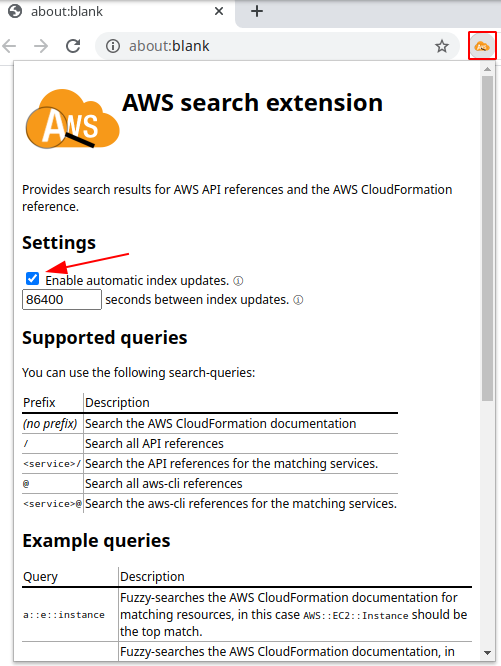
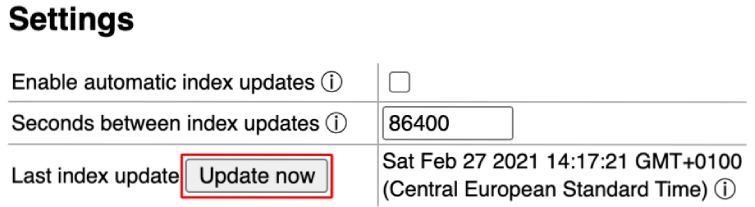
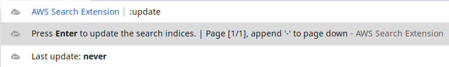

# AWS search extension

AWS search extension is a browser-extension compatible with Google Chrome, Mozilla Firefox and Microsoft Edge (and probably most Chromium-based browsers).
It provides search results for AWS API references and the AWS CloudFormation reference, and opens the official AWS documentation page when you select an item by pressing Enter.


You can **start searching by typing the keyword `ase` into the searchbar,** followed by a space (or also tab in Chromium-based browsers), which will select the AWS search extension.
Everything you now type will search through the included indices of the AWS CloudFormation documentation and the AWS API and aws-cli references.

You can find detailed information on how to structure your queries in the sections below.

## Privacy

The AWS search extension computes all search-suggestions locally and never sends your queries, or any other data, to any external server!
Please note that it does retrieve the indices supporting the local search-suggestions by default once per day (given you perform a search).
If you are not comfortable with this, you can opt out of automatic index updates in the extension's configuration, see below for more information.

Please note that the extension **can not** guarantee that your browser doesn't collect any data for the queries you enter into its omnibox.

## Supported queries

You can use the following kinds of search-queries:

| Prefix                                | Description                                               |
| ------------------------------------- |-----------------------------------------------------------|
| *(no prefix)* or `/`                  | Search all API references.                                |
| `<service>/`                          | Search the API references for the matching services.      |
| `@`                                   | Search all aws-cli references.                            |
| `<service>@`                          | Search the aws-cli references for the matching services.  |
| `:` *(or `::` anywhere in the query)* | Search the AWS CloudFormation and AWS SAM documentations. |

### Example queries

* `createmultipart` or `/createmultipart`

    Fuzzy-searches all AWS API references for API-operations matching `createmultipart`.

    

* `lambda/invoke`

    Fuzzy-searches the AWS Lambda API-reference for API-operations matching `invoke`.

    

* `api/getapp`

    Searches API-operations matching `getapp` in all services matching `api`.

    

* `@get-cal`

    Searches all CLI-operations matching `get-cal`.

    

* `elbv2@wait`

    Searches the AWS Elastic Load Balancing v2 CLI-operations matching `wait`.

    

* `data@job`

    Searches CLI-operations matching `job` in all services matching `data`.

    

* `a::e::instance`

    Fuzzy-searches the combined AWS CloudFormation and AWS SAM documentation for matching resources, in this case `AWS::EC2::Instance` should be the top match.

    

* `:findinmap`

    Fuzzy-searches the combined AWS CloudFormation and AWS SAM documentation for the matching documentation for `Fn::FindInMap`.

    

* `a::serverless:function`

    Fuzzy-searches the combined AWS CloudFormation and AWS SAM documentation for the matching documentation for `AWS::Serverless::Function`.

## FAQ

* *How are the results computed so fast?*

    The extension uses pre-built indices to support a fast search.
    The indices contain just enough data to be useful to the users, but not too much to slow down the search.

* *How are the indices updated?*

    By default, the extension will update the indices used for search-suggestions once per day (specifically after a search has been performed).

    If you don't want the extension to perform any outgoing requests, you can disable the automatic index updates in the extension settings dialog, which you can open by clicking on the AWS search extension icon in your browser's extension menu:

    

    Within the dialog you can also configure how often the extension should update the indices, the default for which is set to 86400 seconds (i.e. 1 day).
    A one-day interval is a sane default you shouldn't have to reduce, since the index-sources are usually updated at most once per day.
    (You can't set the update-interval lower than 1 hour.)

    Please note that disabling the automatic index updates will obviously lead to the indices becoming outdated, and only receiving updates whenever the extension itself is updated (which currently only happens if features are added or bugs are fixed).

    You also have the option to manually update the indices through the settings popup, which you can open by clicking on the AWS search extension icon in your browser's extension menu:

    

    The timestamp for the last update will be shown as grey while the extension is updating the indices (which, depending on your internet connection, should not take more than 1-3 seconds) and then automatically update to the current timestamp once the update has finished successfully.

    Alternatively you can also use your browser's omnibox to trigger an update.
    Activate the AWS search extension (by typing `ase` followed by a space), then enter `!update`.
    You will see a result informing you to hit "Enter" to trigger an index update, and it also informs you when the indices were last updated:

    

    Updates triggered through the omnibox will execute in the background and will usually finish in a few seconds.
    Please note that you will not get further feedback on the status of the update if you trigger it through the omnibox.

* *What requests are being made for manual or automatic index updates?*

    If you execute a manual index update or opt into automatic index-updates, the extension will request the latest JSON-indices from the following URLs:

    ```
    https://raw.githubusercontent.com/pitkley/aws-search-extension/indices/api.json
    https://raw.githubusercontent.com/pitkley/aws-search-extension/indices/cfn.v2.json
    https://raw.githubusercontent.com/pitkley/aws-search-extension/indices/cli.json
    ```

    In other words, it will retrieve the pre-built indices from GitHub out of the `indices` branch that is part of this repository.
    **No other requests will be made!**

    You can verify how these indices are built and committed from within this repository:

    * The [`hack/`](hack/) subdirectory includes the scripts used for generating the JSON-indices.
    * [`.github/workflows/ci.yml`](.github/workflows/ci.yml) contains the CI-code that will generate the indices and automatically commit it to the `indices` branch.

## <a name="license"></a> License

aws-search-extension is licensed under either of

* Apache License, Version 2.0, ([LICENSE-APACHE](LICENSE-APACHE) or <https://www.apache.org/licenses/LICENSE-2.0>)
* MIT license ([LICENSE-MIT](LICENSE-MIT) or <https://opensource.org/licenses/MIT>)

at your option.

### <a name="license-contribution"></a> Contribution

Unless you explicitly state otherwise, any contribution intentionally submitted for inclusion in aws-search-extension by you, as defined in the Apache-2.0 license, shall be dual licensed as above, without any additional terms or conditions.

## Affiliation

This repository and the extension have no official affiliation with Amazon Web Services, Inc., Amazon.com, Inc., or any of its affiliates.
Amazon Web Services is a trademark of Amazon.com, Inc. or its affiliates in the United States and/or other countries.
